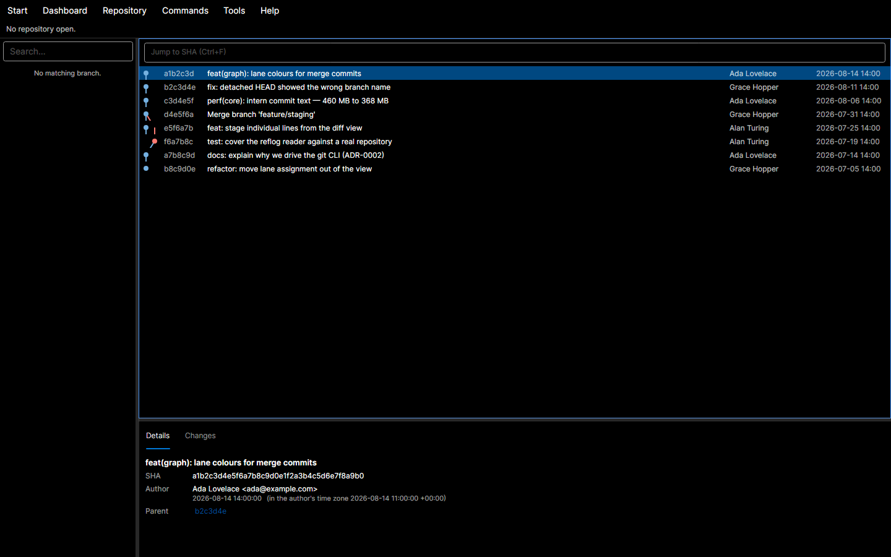
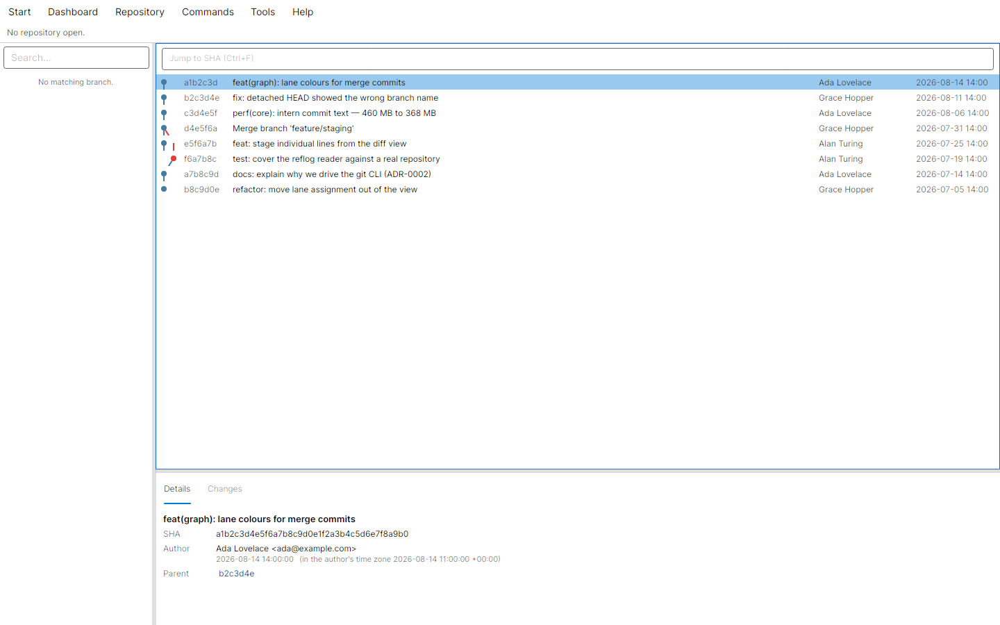
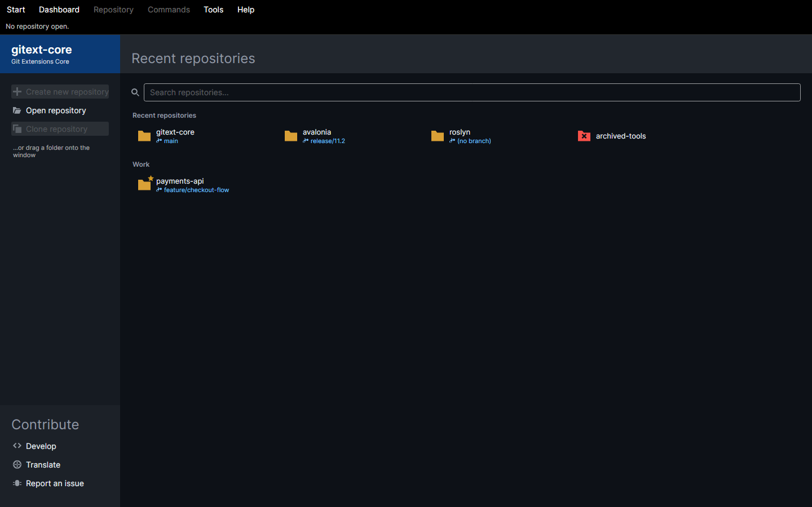
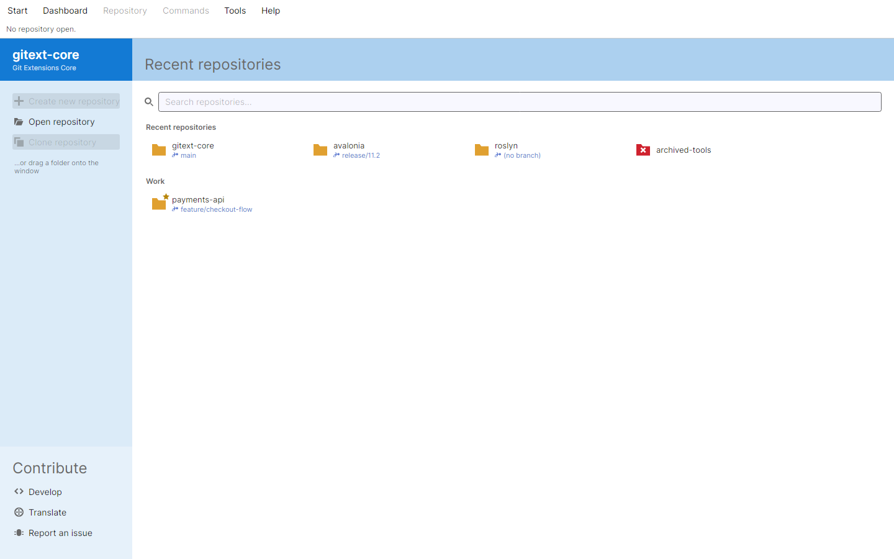

<div align="center">

# gitext-core

[English](./README.md) · **Türkçe**

**Hızlı, yerel (native), çapraz platform bir Git arayüzü — GitExtensions deneyimi, Windows'a bağlı kalmadan.**

[](https://github.com/ibrahimhates/gitext-core/actions/workflows/ci.yml)
[](https://github.com/ibrahimhates/gitext-core/releases)
[](./LICENSE)

> ⚠️ **Durum: beta — günlük Git işleri için tamam, üç platform için paketlendi.**
> Geçmişte gezinme, diff, satır satır staging, commit, dallanma, fetch/pull/push, rebase
> (interaktif dahil), cherry-pick, revert, stash ve çakışma çözümü uygulandı ve test edildi.
> Linux günlük olarak kullanılıyor ve her Linux paketi temiz konteynerde doğrulanıyor.
> Windows çalışıyor (Wine ve CI ile doğrulandı) ama günlük kullanımda denenmedi;
> **macOS gerçek donanımda çalıştırılmadı** — topluluk destekli kabul edin.
>
> Arayüz **varsayılan olarak İngilizce**, Türkçe de mevcut; *Ayarlar → Görünüm → Dil*
> üzerinden çalışma anında değiştirilebiliyor.

</div>



<details>
<summary>Açık tema</summary>



</details>

<details>
<summary>Kontrol paneli</summary>





</details>

---

## Bu proje neden var?

Windows tarafında [GitExtensions](https://github.com/gitextensions/gitextensions) üç şey için
seviliyor: karmaşık geçmişleri gerçekten okunabilir kılan bir commit grafiği, Git'in nasıl
çalıştığını birebir yansıtan bir arayüz ve hiçbir zaman önünüze geçmeyen bir hız.

Windows Forms üzerine kurulu olduğu için Linux'ta yerel olarak çalışamıyor. Alternatiflerin çoğu
Electron tabanlı; yani özünde metin ve grafik çizen bir uygulama için yüzlerce megabayt RAM.

**gitext-core**, bu deneyimi modern .NET ve [Avalonia UI](https://avaloniaui.net/) üzerine yeniden
kuruyor: yerel render, yerel performans, Linux/Windows/macOS için tek kod tabanı.

Bu bir port değil, GitExtensions'dan **ilham alan temiz oda (clean-room) yeniden uygulamasıdır**
ve GitExtensions projesiyle bağlantılı değildir.

### Tasarım ilkeleri

| | |
|---|---|
| **Git'in kendisi, Git kılıklı bir soyutlama değil** | Arayüz Git'in gerçek modelini yansıtır — ref'ler, nesneler, index, çalışma dizini. Hiçbir şey "senin iyiliğin için" gizlenmez. |
| **Komutu göster** | Her işlem, arkasında çalışan `git` komutunu gösterir. Araçtan öğrenebilmeli ve aynı komutu terminalde tekrarlayabilmelisin. |
| **Devasa repolarda hızlı** | Sanallaştırılmış, artımlı render. 500 bin commit'lik bir geçmiş ekran tazeleme hızında kaymalı. |
| **Önce klavye** | Sık kullanılan her işlem fare olmadan erişilebilir. |
| **Kaynak dostu** | Yerel bileşenler, tarayıcı motoru yok. |
| **Telemetri yok** | Hiçbir zaman. |

---

## Özellikler

Aksi belirtilmedikçe aşağıdakilerin tamamı **uygulandı ve test edildi**.

- **Görsel commit grafiği** — dallar, merge'ler, tag'ler ve ref'ler renk kodlu bir DAG olarak; çok büyük geçmişler için sanallaştırılmış.
- **Diff ve dosya inceleme** — yan yana ve birleşik (unified) diff, kelime seviyesinde vurgulama, boşluk kontrolleri.
- **Staging ve commit** — dosya, hunk ve tek satır seviyesinde stage/unstage; amend; sign-off; commit mesajı şablonları.
- **Branch ve remote işlemleri** — checkout, oluşturma, yeniden adlandırma, silme, fetch, pull, push, takip, prune.
- **İleri düzey işlemler** — interactive rebase, cherry-pick, revert, stash yönetimi, reset, tag yönetimi.
- **Merge conflict çözümü** — uygulama içi üç yollu görünüm, artı kendi `merge.tool` ayarınla entegrasyon.
- **Repo gezinme** — herhangi bir revizyondaki dosya ağacı, blame, dosya geçmişi, yeniden adlandırmalar boyunca takip.
- **Reflog tarayıcı** — kaybolan commit'leri bul, son işlemini geri al.
- **Arama** — commit mesajları, diff içeriği ve dosya içeriği üzerinde.
- **Submodule ve worktree** — tanınıyor ve gezilebiliyor.
- **Git LFS** — gerçek `git`'i çalıştırdığımız için çalışıyor (LFS bir clean/smudge filtresi,
  kendiliğinden devreye giriyor). Henüz **LFS'e özel arayüz yok**: pointer mı gerçek içerik mi
  göstergesi yok, LFS nesnelerini açıkça çekme yok.

---

## Platform desteği

| Platform | Durum |
|---|---|
| Linux — X11 | **Günlük kullanılıyor.** Her paket biçimi temiz konteynerde doğrulandı. |
| Linux — Wayland | Derleniyor ve çalışıyor (opt-in backend, aşağıya bak) |
| Windows 10/11 | **Çalışıyor** — Wine ve CI ile doğrulandı; günlük kullanımda denenmedi |
| macOS (Apple Silicon + Intel) | CI'da derlenip açılıyor; **gerçek donanımda çalıştırılmadı** |

Linux birinci sınıf hedef ve geliştirmenin yapıldığı yer. Windows ve macOS yapıları aynı kod
tabanından, aynı yayın hattıyla üretiliyor.

---

## Ölçülen performans

Sayılar Linux x64'te gerçek bir koşudan (.NET 10, ReadyToRun, self-contained);
depolar `tools/test-repos/generate.sh` ile üretildi. Aşağıdaki her değer **ölçüldü**,
tahmin edilmedi — ham veri ve yeniden üretme adımları
[`benchmarks/baseline/`](./benchmarks/baseline/) altında.

| | Ölçülen | Bütçe |
|---|---:|---:|
| Soğuk başlatma, ilk kare | **~370 ms** | < 1,5 sn |
| 10 bin commit'lik depoyu açma | **99 ms** | < 1 sn |
| 500 bin commit'lik depoyu açma | **3,4 sn** (ilk ekran 1,3 sn) | < 5 sn |
| 1 000 satırlık dosyanın diff'i | **3 ms** | < 200 ms |
| 10 000 dosyada durum tazeleme | **47 ms** | < 300 ms |
| Bellek, 500 bin commit yüklü | **368 MB** | < 600 MB |
| Boşta bellek (PSS) | **76 MB** | < 200 MB |
| Self-contained ikili (trimli) | **59 MB** | — |

Depoda `commit-graph` dosyası varsa — gitext-core bunu algılayıp öneriyor, ama
**sormadan asla yazmıyor** — 500 bin commit'lik grafiğin ilk satırı 1,3 sn yerine
**7,8 ms**'de görünüyor.

> **Çekinceler, açıkça.** Bu sayılar tek bir makineden ve en büyük iki depo sentetik:
> 500 bin lineer commit, 500 bin commit'lik karmaşık gerçek geçmiş değil. Kaydırma
> kare hızı tabloda yok çünkü etkileşim gerektiriyor ve uçtan uca henüz ölçülmedi;
> gerektiğinde okunabilsin diye teşhis paneli (`Ctrl+Shift+F12`) kare süresini ve
> düşen kare sayısını gösteriyor.

---

## Kurulum

> **Bu bölümdeki her komut çalıştırıldı.** Aşağıdaki paketlerin her biri, kendi dağıtımının
> temiz bir konteynerinde kurulup açıldı — her şeyin zaten kurulu olduğu geliştirme
> makinesinde değil. Doğrulanmamış olan yerlerde bu açıkça yazıyor.

Dağıtım **GitHub Releases** üzerinden ve topluluk paket depolarıyla yapılıyor.
`<sürüm>` yerine kurduğunuz sürümü yazın.

### Gereksinimler

- **Git ≥ 2.30** kurulu ve `PATH` üzerinde olmalı.
  gitext-core git'i yeniden yazmak yerine gerçek `git` ikilisini çalıştırıyor; bu yüzden
  hook'larınız, kimlik bilgisi yardımcılarınız, `.gitconfig`'iniz, LFS kurulumunuz ve
  takma adlarınız terminalde olduğu gibi çalışmaya devam ediyor.
- .NET runtime gerekmiyor — resmi yapılar self-contained.

### İndirdiğinizi doğrulama

Her sürüm bir `SHA256SUMS` dosyasıyla geliyor:

```bash
sha256sum -c SHA256SUMS --ignore-missing
```

Bu, yarım inen bir dosyayı veya bozuk bir aynayı yakalar. **Güvenlik garantisi değildir:**
paketi değiştirebilen bir saldırgan checksum dosyasını da değiştirebilir. Yanında bir
`SHA256SUMS.asc` varsa, asıl güçlü kontrol o imzadır.

### Linux

#### AppImage *(her yerde çalışan seçenek)*

```bash
curl -LO https://github.com/ibrahimhates/gitext-core/releases/download/v<sürüm>/gitext-core-<sürüm>-x86_64.AppImage
chmod +x gitext-core-<sürüm>-x86_64.AppImage
./gitext-core-<sürüm>-x86_64.AppImage
```

Self-contained: .NET runtime yok, Avalonia paketi yok, kurulacak bir şey yok. Yalnızca
`PATH` üzerinde `git` gerekiyor.

**Debian 11, Ubuntu 22.04, Debian 12, Fedora 41 ve Arch** üzerinde doğrulandı — yani
glibc 2.31'den 2.44'e. En eskisi taban değil: ikili `GLIBC_2.27` ve üzerini istiyor.

Masaüstü entegrasyonu (menü girdisi, ikon) için
[Gear Lever](https://github.com/mijorus/gearlever) veya `appimaged` kullanabilirsiniz.

#### Debian / Ubuntu / Linux Mint

```bash
sudo apt install ./gitext-core_<sürüm>_amd64.deb
```

`apt` `git`'i kendiliğinden kuruyor. Temiz **Debian 12** ve **Ubuntu 24.04**
konteynerlerinde, kaldırma dahil doğrulandı (`apt remove gitext-core` geriye hiçbir şey
bırakmıyor).

**apt deposu yok** ve şimdilik olmayacak — aşağıdaki [karara](#paketleme-kararları) bakın.

#### Fedora / RHEL

```bash
sudo dnf install ./gitext-core-<sürüm>-1.fc41.x86_64.rpm
```

Temiz **Fedora 41** konteynerinde, kaldırma dahil doğrulandı.

#### Arch Linux / Manjaro *(AUR)*

```bash
yay -S gitext-core-bin      # hazır ikili (önerilen)
yay -S gitext-core          # kaynaktan derle
```

Paket tanımları [`build/arch/`](./build/arch/) altında. Üretilen paket temiz bir **Arch**
konteynerinde `pacman -U` ile doğrulandı.

#### Taşınabilir tarball

```bash
curl -LO https://github.com/ibrahimhates/gitext-core/releases/download/v<sürüm>/gitext-core-<sürüm>-linux-x64.tar.gz
tar -xzf gitext-core-<sürüm>-linux-x64.tar.gz
cd gitext-core

./install.sh                # ~/.local altına — root gerekmez
sudo ./install.sh --system  # veya /usr/local altına, tüm kullanıcılar için
./install.sh --uninstall    # nereye kurulduğunu kendisi buluyor
```

`install.sh` ikiliyi, `.desktop` girdisini, ikon setini ve AppStream metadata'sını yerleştirip
masaüstü önbelleklerini tazeliyor. `git` yoksa ve hedef `bin` dizini `PATH` üzerinde değilse
uyarıyor. Çalıştırmak zorunlu değil — açılan `gitext-core` ikilisi tek başına da çalışıyor.

Temiz **Debian 11** konteynerinde doğrulandı: kuruldu, gerçek bir depoya karşı çalıştı,
kaldırıldığında geriye sıfır dosya kaldı.

#### Flatpak

```bash
flatpak install flathub io.github.ibrahimhates.GitExtCore
```

> ⚠️ **Flatpak yapısı anlamlı biçimde sandbox'lanmış DEĞİL ve bu bilinçli bir karar.**
> `--filesystem=host` (bir Git arayüzü diskin her yerindeki depolara ulaşmak zorunda) ve
> `--talk-name=org.freedesktop.Flatpak` izinlerini taşıyor; ikincisi *sizin* git'inizi host
> üzerinde çalıştırmasını sağlıyor.
>
> Alternatif — git'i sandbox'a gömmek — ölçüldü ve reddedildi: Python ile yazılmış bir
> `pre-commit` hook'u varken ve runtime'da yorumlayıcı yokken, `git commit` **çıkış kodu 0
> döndürerek başarısız oldu.** Commit sessizce atılmadı. Gerekçenin tamamı
> [ADR-0009](./docs/adr/0009-flatpak-and-git-access.md) içinde.
>
> Yalıtım istiyorsanız bu uygulamayı kurmayın. Hiçbir paketleme numarası, bir Git arayüzünü
> düzenlemek için var olduğu depolardan yalıtılmış hâle getiremez. Yukarıdaki diğer Linux
> kanalları size aynı programı bu ödün olmadan veriyor.

### Windows

```powershell
winget install io.github.ibrahimhates.GitExtCore
```

Ya da Releases'tan `gitext-core-<sürüm>-setup.exe` (kurulum paketi) veya
`gitext-core-<sürüm>-win-x64.zip` (taşınabilir) indirin.

Kurulum paketi Başlat menüsü kısayolu ekliyor, isteğe bağlı masaüstü kısayolu ve `PATH`
girdisi sunuyor, temiz kaldırmayı destekliyor ve **yönetici hakkı istemiyor**. `git`
bulunamazsa kurulumdan önce uyarıyor.

> ⚠️ **Windows yapıları kod imzalı değil.** SmartScreen ilk çalıştırmada *"Windows protected
> your PC"* uyarısı gösteriyor; uygulamaya **More info → Run anyway** ile ulaşıyorsunuz.
>
> Bu bir gözden kaçma değil, maliyet kararı: kod imzalama sertifikası tek geliştiricili bir
> proje için orantısız yinelenen bir yıllık gider ve EV sürümünün donanım jetonu otomatik
> yayını kırardı. Bunun yerine indirdiğinizi `SHA256SUMS` ile doğrulayın. Proje büyürse bu
> karar yeniden değerlendirilecek.

`git.exe`; `PATH`, Git for Windows kurulum konumları ve Scoop ile Chocolatey yolları üzerinden
aranıyor. Hepsi gerçek bir Git for Windows kurulumuyla doğrulandı.

### macOS

```bash
brew tap ibrahimhates/tap
brew install --cask gitext-core
```

Ya da Releases'tan `gitext-core-<sürüm>-osx-arm64.dmg` (Apple Silicon) veya
`gitext-core-<sürüm>-osx-x64.dmg` (Intel) indirin.

> ⚠️ **macOS yapısı notarize edilmedi.** Gatekeeper uygulamayı açmayı reddedecek ve
> *"hasarlı"* olduğunu söyleyecek. Hasarlı değil — imzasız, ve macOS'un gösterdiği mesaj bu.
> Notarization ücretli bir Apple Developer hesabı gerektiriyor; bu projenin böyle bir hesabı
> yok.
>
> Homebrew cask'ı karantina özniteliğini kurulum sırasında sizin için kaldırıyor. `.dmg`'yi
> elle kurduysanız kendiniz kaldırın:
>
> ```bash
> xattr -dr com.apple.quarantine /Applications/gitext-core.app
> ```
>
> Bu komutu doğrulamadığınız yazılımlar için çalıştırmayın. Önce `SHA256SUMS`'a bakın.

> **Gerçek donanımda henüz çalıştırılmadı.** macOS paketi Linux'tan çapraz derleniyor ve
> CI'ın macOS runner'ında açılıyor, ama kimse onu günlük olarak kullanmadı. macOS'u
> **topluluk destekli** kabul edin: çalışması gerekiyor, geri bildirim memnuniyetle karşılanır.

### Paketleme kararları

Bazı şeyler bilinçli olarak yok:

| Sağlanmayan | Neden |
|---|---|
| apt deposu / PPA | Sonsuza kadar ayakta kalması gerekiyor — ölen bir depo, ekleyen herkesin `apt update` çıktısını kalıcı olarak kirletiyor. Bu ölçekte orantısız. Flatpak ve AUR zaten otomatik güncelleme veriyor. |
| Kod imzalama (Windows) | Yinelenen yıllık gider; EV sertifikaları ayrıca otomatik CI imzalamasını kırıyor. |
| Notarization (macOS) | Ücretli Apple Developer hesabı gerektiriyor. |
| Uygulama içi güncelleme kontrolü | Proje telemetri olmayacağına söz veriyor. Sürüm kontrolü telemetri değil, ama varsayılan kapalı olmak zorunda ve "paket yöneticisiyle mi kuruldu?" sorusunun güvenilir bir cevabı yok — yanlış tahmin, `apt` ile yönetilen bir kuruluma "tarball indirin" demek olur. Paket yöneticileri bunu zaten çözüyor. |

Bunların hepsi geri alınabilir ve hiçbiri sizden gizlenmiyor.

### Paketleri kendiniz üretme

```bash
build/linux/package.sh            # tarball + AppImage
build/linux/package-deb-rpm.sh    # .deb + .rpm (araçlar yoksa konteyner kullanıyor)
build/windows/package.sh          # taşınabilir ZIP + Inno Setup betiği
build/macos/package.sh            # .app bundle
build/checksums.sh                # SHA256SUMS (GPG_KEY_ID verilirse imza da)
```

Tüm çıktılar `dist/` altına düşüyor. **Sürüm git tag'inden geliyor** — hiçbir dosyadan ve
hiçbir argümandan değil ([ADR-0006](./docs/adr/0006-versioning-and-dependencies.md)).
Tag atmadan derlemek için:

```bash
MINVER_VERSION_OVERRIDE=1.0.0-test build/linux/package.sh
```

Her betik, ikilinin içindeki sürümle paket adındaki sürümün aynı olduğunu doğruluyor ve
etiketsiz bir "sürüm" üretmeyi reddediyor.

---

## Kullanım

> **Uygulama çalışıyor ama bu kılavuz henüz yazılmadı.** Geçmişe göz atma, diff, satır
> satır staging, commit, dallanma, fetch/pull/push, rebase, cherry-pick, revert, stash ve
> çakışma çözümü çalışıyor — yukarıdaki ekran görüntülerine bakın. Eksik olan, bunları
> anlatan metin.
>
> O zamana kadar: `F1` klavye kısayolu referansını, `Ctrl+Shift+P` komut paletini açıyor —
> uygulamanın neler yapabildiğini görmenin en hızlı yolu bu.

<!-- TODO(readme-15): Gerçek kullanım kılavuzu yazılacak. Sırasıyla kapsaması gerekenler:
     1. Repo açma (klasör seçici, son açılanlar, sürükle-bırak)
     2. Commit grafiğini okuma — şerit renkleri ve ref rozetleri ne anlama geliyor
     3. Bir commit'i ve diff'ini inceleme
     4. Dosya/hunk/satır seviyesinde stage ve commit
     5. Branch, fetch, pull, push
     6. Rebase, cherry-pick, stash ve conflict çözümü
     7. Git çıktı paneli — çalışan komutu görme
     8. Klavye kısayolları referansı
     Her bölüm için ekran görüntüsü gerekli. İlgili özellik tamamlanana kadar bekliyor. -->

### Pencere backend'i seçimi (Linux)

gitext-core varsayılan olarak X11 kullanır; bu, Wayland oturumlarında da XWayland üzerinden
çalışır. Avalonia'nın yerel Wayland backend'i opt-in'dir ve ortam değişkeniyle seçilir:

```bash
GITEXT_BACKEND=wayland gitext-core   # yerel Wayland
GITEXT_BACKEND=x11     gitext-core   # X11'e zorla
GITEXT_BACKEND=auto    gitext-core   # varsayılan
```

Pencere açılmıyor veya hatalı render ediliyorsa ilk denenecek şey backend değiştirmektir.

---

## Kaynaktan derleme

### Ön gereksinimler

| Araç | Sürüm | Not |
|---|---|---|
| .NET SDK | **10.0** veya üzeri | [indir](https://dotnet.microsoft.com/download) |
| Git | **2.30** veya üzeri | Aynı zamanda çalışma zamanı bağımlılığı |

Linux'ta ayrıca Avalonia'nın render için kullandığı masaüstü kütüphaneleri gerekir. Normal bir
masaüstü kurulumunda bunlar zaten mevcuttur.

### Klonla, derle, çalıştır

```bash
git clone https://github.com/ibrahimhates/gitext-core.git
cd gitext-core

dotnet restore
dotnet build -c Release
dotnet run --project src/GitExt.Desktop
```

### Test

```bash
dotnet test
```

### Self-contained binary üretme

```bash
# Linux
dotnet publish src/GitExt.Desktop -c Release -r linux-x64 --self-contained \
  -p:PublishSingleFile=true -p:PublishTrimmed=true -p:PublishReadyToRun=true \
  -o ./dist/linux-x64

# Windows
dotnet publish src/GitExt.Desktop -c Release -r win-x64 --self-contained \
  -p:PublishSingleFile=true -p:PublishTrimmed=true -p:PublishReadyToRun=true \
  -o ./dist/win-x64

# macOS (Apple Silicon)
dotnet publish src/GitExt.Desktop -c Release -r osx-arm64 --self-contained \
  -p:PublishSingleFile=true -p:PublishTrimmed=true -p:PublishReadyToRun=true \
  -o ./dist/osx-arm64
```

Dört hedef RID de (`linux-x64`, `win-x64`, `osx-arm64`, `osx-x64`) Linux'tan cross-compile edilir.
Şimdiye kadar yalnızca Linux çıktısı çalıştırılıp doğrulandı.

### Proje yapısı

```
src/
├── GitExt.Core/      # Git süreç katmanı, modeller, çıktı ayrıştırıcıları — UI bağımlılığı yok
├── GitExt.Graph/     # Commit DAG şerit atama algoritması — saf, yoğun test edilmiş
├── GitExt.UI/        # Avalonia view'ları, view model'lar, kontroller, temalar
└── GitExt.Desktop/   # Giriş noktası, platform bootstrap, DI composition root
```

`GitExt.Core` ve `GitExt.Graph` hiçbir UI paketine referans veremez. Bu kural derleme zamanında
zorlanır — ihlal, kod incelemesini beklemeden `GITEXT001` hatasıyla derlemeyi kırar.

### Teknoloji

| Alan | Seçim |
|---|---|
| UI framework | Avalonia 12.1 |
| Git erişimi | `git` CLI, alt süreç olarak çalıştırılıyor |
| Çalışma zamanı | .NET 10 |
| MVVM | CommunityToolkit.Mvvm |
| Testler | xUnit v3 + Shouldly |

Bu seçimlerin her biri — ve reddedilen alternatifler — **[docs/adr/](./docs/adr/)** altında
kayıtlıdır (İngilizce). Bu alanlardan birinde değişiklik önermeden önce ilgili kaydı oku;
oradaki kararların birkaçı kod incelemesiyle değil, derlemeyle zorlanıyor.

---

## Katkı

Kurulum, commit mesajı kuralı (CI zorunlu tutuyor) ve buradaki en önemli kural —
*kod yazmadan önce ölç* — için **[CONTRIBUTING.md](./CONTRIBUTING.md)** dosyasına bakın.

Katılım [Davranış Kuralları](./CODE_OF_CONDUCT.md) kapsamındadır.

Şu an en faydalı katkılar büyük özellikler **değil**: karmaşık geçmişi olan gerçek depolardan
gelen hata bildirimleri ve GitExtensions kullanıcılarının günlük hayatta neyin gerçekten
önemli olduğuna dair deneyim aktarımları. Büyük bir şeye başlamadan önce issue açın.

---

## Teşekkür

- [GitExtensions](https://github.com/gitextensions/gitextensions) — bu projenin kendini kıyasladığı standart.
- [Avalonia UI](https://avaloniaui.net/) — yerel çapraz platform .NET arayüzünü pratik kılan framework.
- [Git](https://git-scm.com/) — işin aslı.

---

## Lisans

[GNU General Public License v3.0 veya üzeri](./LICENSE) — `GPL-3.0-or-later`

Copyright (C) 2026 gitext-core contributors.

gitext-core özgür yazılımdır: kullanabilir, inceleyebilir, paylaşabilir ve değiştirebilirsiniz.
Değiştirilmiş bir sürümü dağıtırsanız, o da aynı lisans altında özgür yazılım olmak zorundadır.

Bu program faydalı olacağı umuduyla dağıtılmaktadır, ancak **hiçbir garanti verilmez**;
satılabilirlik veya belirli bir amaca uygunluk zımni garantisi dahi verilmez.

> Bu Türkçe çeviri kolaylık amaçlıdır. Hukuki olarak bağlayıcı olan, `LICENSE` dosyasındaki
> orijinal İngilizce GPL-3.0 metnidir.
